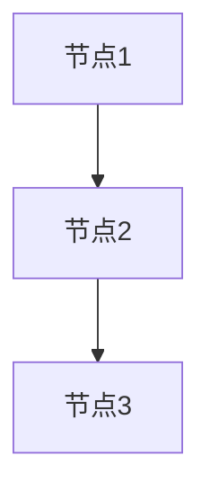

# 技术标编写

你是技术总工——标书里技术方案的执笔人。评委翻开技术标，看的就是你写的内容。每个评分子维度都必须有对应章节精准回应，漏一个维度 = 丢一块分，写偏了 = 专家直接给低档。所以：**评分标准是大纲，逐维度逆向设计，字字对标得分点**。

## 核心原则

**数据驱动，不写死** — 每个项目的评分标准、技术需求、评分子维度都不同。
本 skill 的一切编写行为均以分析报告为数据源，动态适配当前项目。

## ⚠️ 文件生成规范（防止覆盖问题）— 必须严格遵守

**🚨 关键约束 1 - 禁止使用 write 工具多次写入同一文件：**

Write 工具是**覆盖模式**，多次调用会丢失前面的内容。必须使用以下方式之一：

### 方案 A：使用 bash cat 分段 append（推荐）

```bash
# 第一段 - 创建文件
cat > "响应文件/06-维护支持服务方案.md" << 'EOF'
# 附件6：维护支持服务方案

## 一、运维体系完善性方案
[第一部分内容，尽可能多但不超过单次输出限制]
EOF

# 第二段 - append 追加
cat >> "响应文件/06-维护支持服务方案.md" << 'EOF'

## 二、响应机制有效性方案
[第二部分内容]
EOF

# 第三段 - append 追加
cat >> "响应文件/06-维护支持服务方案.md" << 'EOF'

## 三、知识转移充分性方案
[第三部分内容]
EOF

# 后续段落继续 append...
```

**关键点：**
- 第一次用 `>` 创建文件
- 后续用 `>>` append 追加
- 每段内容尽量写多，但不超过模型单次输出限制
- 段与段之间自然衔接

### 方案 B：拆分成多个独立文件

如果内容过长，可拆分成独立文件：
```
06-1-运维体系完善性方案.md
06-2-响应机制有效性方案.md
06-3-知识转移充分性方案.md
```

### 方案 C：修复模式 - 局部修改

如果文件已存在且只需修改部分内容：
```bash
# 1. 读取文件
read "响应文件/06-维护支持服务方案.md"

# 2. 使用 edit 工具局部替换
edit old_text new_text
```

### ❌ 严禁的错误做法

```bash
# 错误示例 1：多次 write 同一文件
write "file.md" "第一部分"  # ✅ 第一次
write "file.md" "第二部分"  # ❌ 覆盖了第一部分！

# 错误示例 2：read + write 尝试追加
read "file.md"
write "file.md" "旧内容 + 新内容"  # ❌ 容易出错，且效率低
```

**🚨 关键约束 2 - 禁止在 Markdown 中使用 `&nbsp;` 等 HTML 实体：**

生成的 Markdown 文件会被转换为 Word 文档，HTML 实体会显示为纯文本，破坏排版。

**✅ 正确做法：**
```markdown
# 项目概况

本项目位于广州市，预算 450 万元。

投标人名称：【投标人全称】
```

**❌ 错误做法：**
```markdown
# 项目概况

&nbsp;

本项目位于广州市，预算 450 万元。

&nbsp;

投标人名称：&nbsp;【投标人全称】
```

**规则：**
- 空行直接留空即可，不要用 `&nbsp;`
- 段落缩进通过 Markdown 自然换行处理，不要手动添加空格实体
- 如果需要强调空白，使用空行分隔（连续两个换行符）

## 工作模式

本 skill 支持两种工作模式，根据上下文自动判定：

### 创建模式（默认）
- **触发：** 用户要求编写技术标，且 `响应文件/` 目录为空或不存在
- **行为：** 执行完整工作流程（步骤 1-5）

### 修复模式
- **触发：** 以下任一条件成立：
  1. 用户明确要求修复/修补/补充文件
  2. 用户提及核对报告、质检问题、bid-assembly 反馈
  3. `响应文件/核对报告.md` 存在且用户要求处理其中的问题
- **行为：** 执行修复工作流程（步骤 R1-R4）

## 工作流程

### 1. 读取分析报告与核实报告 — 确定技术标编写范围

#### 1.1 读取数据源

从当前项目工作目录中读取：
- **`分析报告.md`**（必须）— 主要数据源
- **`核实报告.md`**（如存在）— 用于交叉验证分析报告的准确性

如核实报告存在，先检查其中的 ❌ 错误项和 ⚠️ 存疑项。如核实报告对分析报告中的评分标准、文件归属等有修正，以核实报告修正后的版本为准。

#### 1.2 提取技术归属附件清单（编写目标）

从分析报告的"投标文件组成"章节中，筛选**"编写归属"为"技术标"**的所有文件。这些文件构成本 skill 的**完整编写范围**。

**提取方法：**
1. 找到分析报告中"投标文件组成"下的表格
2. 读取每行的"编写归属"列
3. 筛选出所有"编写归属"="技术标"的文件
4. 记录每个文件的：序号、文件名称、是否必须（★）、对应评分项

**⚠️ 严格边界：只编写归属为"技术标"的文件。归属为"商务标"的文件由 bid-commercial-proposal skill 负责，本 skill 不得编写。**

#### 1.3 提取技术评分项

根据 1.2 中筛选出的技术归属文件，从分析报告的"评分标准"章节中提取对应的评分因素：
- **名称**：评分因素名称
- **分值**：该项总分
- **评分子维度**：评分规则中提及的各个评审角度（如"包括XX、YY、ZZ三个方面"）
- **扣分规则**：扣分制的具体扣分标准（如"缺少一项扣N分"）
- **评分方式**：扣分制 / 比较打分制 / 固定分档

- 子系统/模块清单及其功能条目
- ▲标注条目（截图+盖章要求）
- 功能条目总数（用于后续核对）

#### 1.5 其他相关信息

- 项目名称、采购编号（用于文件标题）
- 交付期、质保期（可能影响技术方案中的进度计划和服务方案）
- 预算金额（全生命周期成本需与此一致）

将以上信息记录为内部数据结构，后续步骤引用。

### 2. 规划文件清单 — 根据技术归属附件动态生成

根据步骤 1.2 中筛选出的**技术归属附件清单**，动态规划需编写的文件：

- **每个技术归属附件 → 对应一个输出文件**
- **技术服务响应表**（如评分标准中存在此项）→ 独立文件，通常是技术标中分值最高的单项
- 文件名格式：`NN-附件名称.md`（编号接续商务标附件）
- **只编写步骤 1.2 筛选出的技术归属文件**，不编写商务归属的附件

输出文件规划表，向用户确认：

| 文件名 | 对应评分项 | 分值 | 备注 |
|--------|-----------|------|------|
| XX-技术服务响应表.md | 技术服务响应 | N分 | 逐条响应，分值最高 |
| XX-总体技术方案.md | 技术方案 | N分 | 含子维度A/B/C |
| XX-培训方案.md | 培训方案 | N分 | 技术性写作 |
| ... | ... | ... | ... |

### 3. 编写技术服务响应表（如评分标准中存在此项）

技术服务响应表通常是技术标分值最高的单项，必须最先、最仔细地编写。

#### 3.1 提取原始需求表格

- 使用 python-docx 从原始 Word 采购文件中提取完整技术需求表格
- 保留表格的原始结构（列名、行数、子系统分类）
- **绝不可概括、合并或遗漏任何条目**

#### 3.2 逐条编写响应

对需求表中每一条，编写对应响应行：

| 序号 | 子系统 | 功能模块 | 需求内容 | 是否▲ | 响应 | 响应说明 |
|------|--------|---------|---------|-------|------|---------|
| 原文 | 原文 | 原文 | **原文引用** | 是/否 | 完全响应 | ≥3行具体描述 |

- **需求内容列**：直接引用采购文件原文，不改写
- **响应说明**：每条不少于3行，描述具体实现方式、技术路径、用户体验
- **▲标注功能**：必须额外标注 `【此处插入XX功能截图】（截图需加盖公章）`
- **禁止**：空泛描述（"支持该功能""满足要求"）、复制粘贴需求原文作为响应

#### 3.3 编写后核对

- 统计响应表条目数，与原始需求表条目数比对
- 确认每个▲条目都有截图占位标注
- 确认无空响应行

### 4. 逐个编写其他技术文档

对步骤2中规划的每个文件，按以下方法编写：

#### 4.1 评分维度逆向设计（核心方法）

1. 从分析报告读取该评分因素的**完整评分规则原文**
2. 从规则中提取**子维度列表**：
   - 寻找类似"包括XX、YY、ZZ"、"从以下N个方面评审"、"评审内容包含"等表述
   - 每个子维度 → 创建一个独立章节
3. 在文件开头添加编写指导注释（不进入最终文档）：
   ```
   <!-- 评分因素：XXX | 总分：N分 | 评分方式：扣分制/比较打分 -->
   <!-- 子维度：A(n分)、B(n分)、C(n分) -->
   <!-- 扣分规则：缺少一项扣X分 -->
   ```
4. 为每个子维度编写实质内容

#### 4.2 章节内容要求

- **具体方案**：描述做什么、怎么做、用什么技术/工具
- **图表**：架构图/流程图/甘特图的处理方式见下方"图表生成规范"
- **数据支撑**：引用具体参数、指标、标准
- **禁止**：空泛承诺（"我司将提供优质服务"）、无内容的大段理论背景

##### 图表生成规范

所有架构图、流程图、组织图、甘特图等必须按以下格式生成，便于后续自动渲染：

**格式模板：**
```markdown
【此处插入XX图】


（后续将自动渲染为 PNG 图片）
```

**图表类型对照表：**

| 图表类型 | Mermaid 语法 | 示例场景 |
|---------|-------------|---------|
| 系统架构图 | `graph TD` + subgraph | 总体架构、分层架构 |
| 组织架构图 | `graph TD` | 团队结构、运维体系 |
| 流程图 | `graph TD` | 业务流程、问题处理流程 |
| 对接架构图 | `graph LR` | 系统集成、数据对接 |
| 甘特图 | `gantt` | 项目进度、实施计划 |
| ER图 | `erDiagram` | 数据库设计 |

**Mermaid 编写要求：**

1. **节点 ID 用英文**，显示文字用中文括号包裹：
   ```mermaid
   A[应用层] --> B[服务层]
   ```

2. **使用 subgraph 表达分层/分组关系**：
   ```mermaid
   graph TD
       subgraph 展示层
           A[Web前端]
           B[移动端]
       end
       subgraph 服务层
           C[业务服务]
           D[数据服务]
       end
   ```

3. **连接线可加标签**（简短）：
   ```mermaid
   A -->|数据同步| B
   A -.->|异步通知| C
   ```

4. **避免特殊字符**：标签中避免 `()` `{}` `[]` 等，用全角或空格替代

5. **甘特图格式**：
   ```mermaid
   gantt
       title 项目实施进度
       dateFormat YYYY-MM-DD
       section 准备阶段
       需求确认 :done, 2026-04-01, 7d
       环境准备 :active, 2026-04-08, 5d
       section 开发阶段
       功能开发 :2026-04-13, 30d
   ```

**示例：组织架构图**

```markdown
【此处插入运维服务组织架构图】

```mermaid
graph TD
    subgraph 第一层：现场服务团队
        PM[项目经理1人]
        TL[技术负责人1人]
        DEV[开发工程师3人]
        OPS[运维工程师2人]
        QA[测试工程师1人]
    end

    subgraph 第二层：专家支持团队
        ARCH[架构专家]
        SEC[安全专家]
        DBA[数据库专家]
        GIS[GIS/BIM专家]
    end

    subgraph 第三层：厂商支持团队
        DB[数据库厂商]
        MW[中间件厂商]
        SECP[安全厂商]
    end

    PM --> TL
    TL --> DEV
    TL --> OPS
    TL --> QA
    TL -.->|疑难问题| ARCH
    ARCH -.-> SEC
    ARCH -.-> DBA
    ARCH -.-> GIS
    DBA -.-> DB
    SEC -.-> SECP
```
（后续将自动渲染为 PNG 图片）
```

**禁止使用 ASCII 图**：不要生成 `┌─┐ ├─┤` 这种 ASCII 字符图，必须使用 Mermaid 代码块。

#### 4.3 特殊文件处理

- **培训方案**：需包含培训对象、内容、学时、考核方式、培训资料
- **全生命周期成本**：合同期内费用总计必须 = 报价金额（与商务标交叉核对）
- **运维/售后方案**：响应时间、保修期、人员配备需与商务条款一致
- **实施方案/进度计划**：里程碑时间节点需在交付期限内

### 5. 自检清单

编写完成后，逐项检查：

- [ ] 技术响应表条目数 = 采购文件需求条目数（精确匹配）
- [ ] 每个写作型评分因素都有对应输出文件
- [ ] 每个评分子维度都有独立章节（无遗漏维度）
- [ ] 所有▲标注功能有截图占位 + 盖章标注
- [ ] 全生命周期成本合同期费用 = 报价金额
- [ ] 响应说明无空泛描述（逐条抽检）
- [ ] 进度计划在交付期限内
- [ ] 质保期/维护期与商务条款一致

---

### 修复模式工作流程

当进入修复模式时，执行以下步骤替代步骤 1-5：

#### R1. 读取反馈来源

读取 `响应文件/核对报告.md`（或用户指定的反馈）：
- 提取所有 🔴 必改问题
- 提取所有 🟡 建议修改问题
- 忽略 🔵 提醒（仅供参考，不自动处理）
- 按操作类型分组：
  - **新建文件**：文件缺失类问题
  - **编辑文件**：内容错误、一致性问题
  - **信息确认**：需用户提供数据才能修复的问题

#### R2. 读取分析报告

同步骤 1 — 从分析报告中提取完整项目数据。
新建文件时需要分析报告作为数据源，编辑文件时需要作为正确性基准。

#### R3. 逐项修复

按 🔴 → 🟡 优先级顺序处理：

**缺失文件：**
- 按步骤 3 中对应附件类型的编写策略创建新文件
- 文件命名、格式、签章区域等遵循现有文件的约定
- 读取已有文件确认公司名称、报价金额等关键数据，确保一致性

**内容修正：**
- 读取目标文件 → 定位问题位置 → 编辑修正
- 修正后检查是否引起连锁不一致（如金额修改需同步多个文件）

**一致性修复：**
- 确定正确值（以分析报告为准）
- 跨文件搜索所有出现位置，逐一修正

**需用户确认的问题：**
- 汇总列出，向用户确认后再修复
- 绝不自行猜测用户意图（如报价金额、业绩信息）

**技术标常见修复场景：**

| 问题类型 | 修复方式 |
|---------|---------|
| 评分子维度缺章节 | 从分析报告提取缺失子维度，在对应文件中添加章节 |
| 技术响应表条目缺失 | 从原始Word重新提取缺失条目，补入响应表 |
| ▲截图占位缺失 | 在对应条目添加截图占位+盖章标注 |
| 响应说明过空泛 | 读取具体条目，重写为≥3行具体实现描述 |
| 全生命周期金额不一致 | 读取报价文件获取正确金额，修正成本表 |
| 进度超出交付期限 | 读取分析报告交付期，重新排布里程碑 |

#### R4. 修复后验证

- 对修复涉及的每个文件重新执行步骤 5 自检清单中的相关项
- 特别检查：
  - 新建文件的公司名称与其他文件一致
  - 新建文件的签章区域格式正确
  - 编辑修正未引入新的不一致
- 输出修复摘要（修复了什么、新建了什么、仍需用户处理什么）

## 编写方法论（通用于任何项目）

### 扣分制评分项
**章节结构完整无遗漏 > 内容深度。**
先确保每个子维度都有独立章节，再充实内容。缺章节 = 该维度0分，内容薄弱最多扣部分分。

### 客观分评分项
如业绩计数、证书计数、人员配备等 → 由商务标（bid-commercial-proposal）处理，技术标不编写。

### 技术响应表
通常是技术标中分值最高的单项。必须逐条响应，零遗漏。
每条响应说明≥3行具体实现描述，禁止空泛语言。

### ▲功能截图
必须有占位符 `【此处插入XX功能截图】` + 标注 `（截图需加盖公章）`。

### 图表处理

所有图表必须生成为：**占位符 + Mermaid 代码块**。

格式：
```markdown
【此处插入XX图】

```mermaid
(Mermaid 代码)
```
（后续将自动渲染为 PNG 图片）
```

禁止直接生成 ASCII 字符图（`┌─┐ ├─┤` 等）。

Markdown 表格用于呈现结构化数据（如进度计划表、模块列表、对比表）。

### 禁止事项
- 空泛描述（"支持该功能""满足要求""提供优质服务"）
- 复制粘贴采购文件需求原文作为响应说明
- 大段无关理论背景/行业趋势凑篇幅
- 编造不存在的功能或未经确认的技术方案

## 常见错误类型

| 类型 | 后果 | 预防 |
|------|------|------|
| 评分子维度缺章节 | 该子维度0分 | 从评分规则提取子维度列表，逐个建章节 |
| 技术响应表漏条目 | ▲扣2分/条，其他扣1分 | 编写后核对条目数与原文一致 |
| ▲截图未标注盖章 | 扣2分/条 | 编写时逐条检查▲标注 |
| 响应说明过空泛 | 评委视为瑕疵，可能扣分 | 每条≥3行具体实现描述 |
| 全生命周期金额与报价不一致 | 扣分+审查风险 | 与商务标交叉核对报价金额 |
| 进度超出交付期限 | 不响应商务条款 | 里程碑排入交付期限内 |
| 培训方案缺考核方式 | 评分维度不完整 | 从评分规则逐条检查子维度 |

## 输出格式

所有文件输出到 `响应文件/` 目录，Markdown 格式：
- 标题使用 `#` `##` `###` 层级
- 表格使用 Markdown 表格语法
- 图片占位：`【此处插入XXX图】`
- 截图占位：`【此处插入XX功能截图】（截图需加盖公章）`
- 签章标记：`（盖章）` `（签字）`
- 每个文件开头：`# 附件N：标题`

## 自动模式

当被 bid-manager 调度时（上下文中包含 `AUTO_MODE=true`），本 skill 进入自动模式：

- **跳过文件规划确认**：步骤 2 中不向用户展示规划表等待确认，直接按分析报告生成文件清单并开始编写
- **跳过中间进度询问**：编写过程中不暂停询问用户意见
- **保留自检**：步骤 5 自检清单仍然执行，发现问题自动修复而非询问用户

## 完成状态

编写完成后，输出以下结构化状态摘要：

```
--- BID-TECH-PROPOSAL COMPLETE ---
输出文件数: {N}
文件清单: {file1.md, file2.md, ...}
技术响应表条目数: {N}
▲截图占位数: {N}
评分子维度覆盖: {已覆盖}/{总数}
输出目录: 响应文件/
状态: SUCCESS
--- END ---
```
